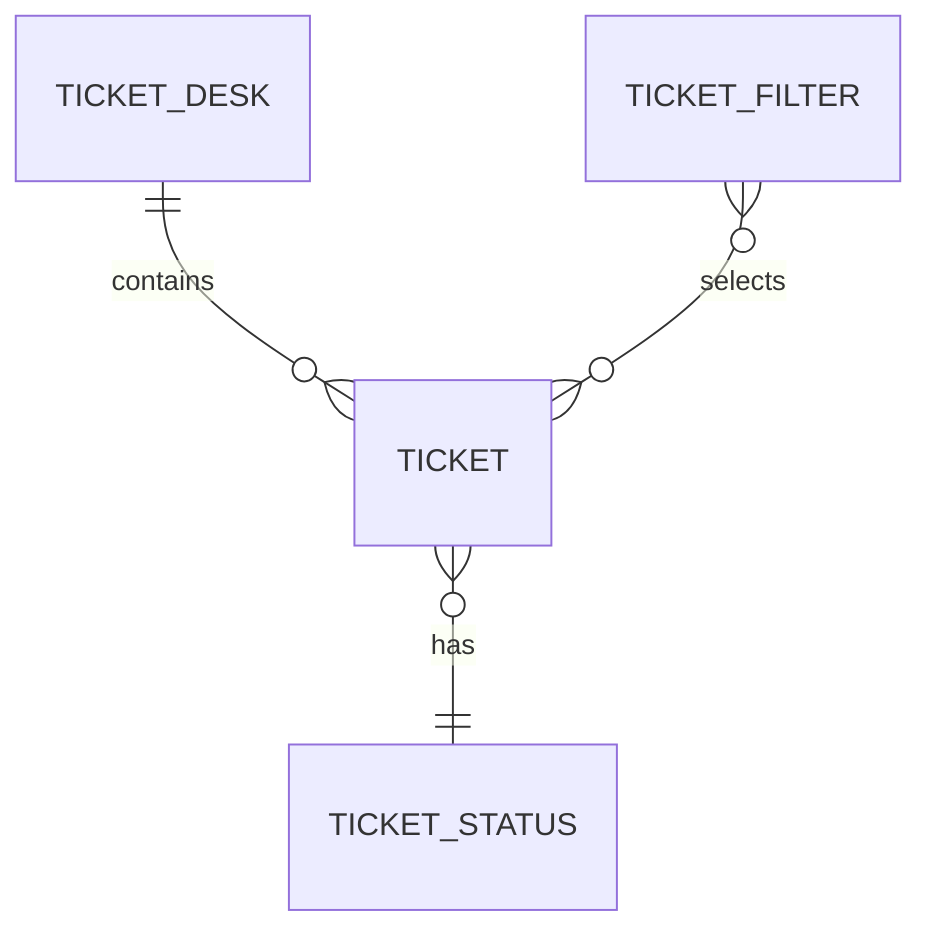

# Ticket desk model

## Purpose

Define the shared ticket desk domain concepts used by the ticket creation, status, and filtering feature specs.

## Model

### TICKET-DESK-M001: Ticket desk

A ticket desk is a single-user browser application for managing support tickets.

| Concept      | Definition                                           |
| ------------ | ---------------------------------------------------- |
| User         | The person using the ticket desk in the browser      |
| Ticket list  | The collection of tickets currently shown to the user |
| Active filter | The status filter currently applied to the ticket list |

### TICKET-DESK-M002: Ticket

A ticket represents one support request.

| Field           | Required | Description                                      |
| --------------- | -------- | ------------------------------------------------ |
| Id              | yes      | Stable internal identifier                       |
| Title           | yes      | 1-80 characters after trimming whitespace        |
| Status          | yes      | One of `open`, `in-progress`, or `resolved`      |
| Resolution note | no       | Required before a ticket can become resolved     |

### TICKET-DESK-M003: Ticket status

Ticket status describes where a support request is in the support flow.

| Status value  | Display label | Meaning                                 |
| ------------- | ------------- | --------------------------------------- |
| `open`        | Open          | The request has been created            |
| `in-progress` | In progress   | Someone has started working on it       |
| `resolved`    | Resolved      | The request has been completed with a note |

### TICKET-DESK-M004: Ticket filter

A ticket filter controls which tickets are visible in the ticket list.

| Filter value | Visible tickets                  |
| ------------ | -------------------------------- |
| `all`        | Every ticket                     |
| `open`       | Tickets with status `open`       |
| `resolved`   | Tickets with status `resolved`   |

## Rules

- TICKET-DESK-R001: A ticket MUST have exactly one status.
- TICKET-DESK-R002: A ticket status MUST be one of `open`, `in-progress`, or `resolved`.
- TICKET-DESK-R003: A ticket title MUST be valid before the ticket can be created.
- TICKET-DESK-R004: A ticket MUST have a resolution note before it can be resolved.
- TICKET-DESK-R005: Filtering MUST NOT change the stored tickets.

## Model Diagram

## Open Questions

- TICKET-DESK-Q001: Should a resolved ticket be reopenable in a future feature?

## Assumptions

- TICKET-DESK-A001: The demo remains a single-user application, so assignment and permissions are outside its current scope.
